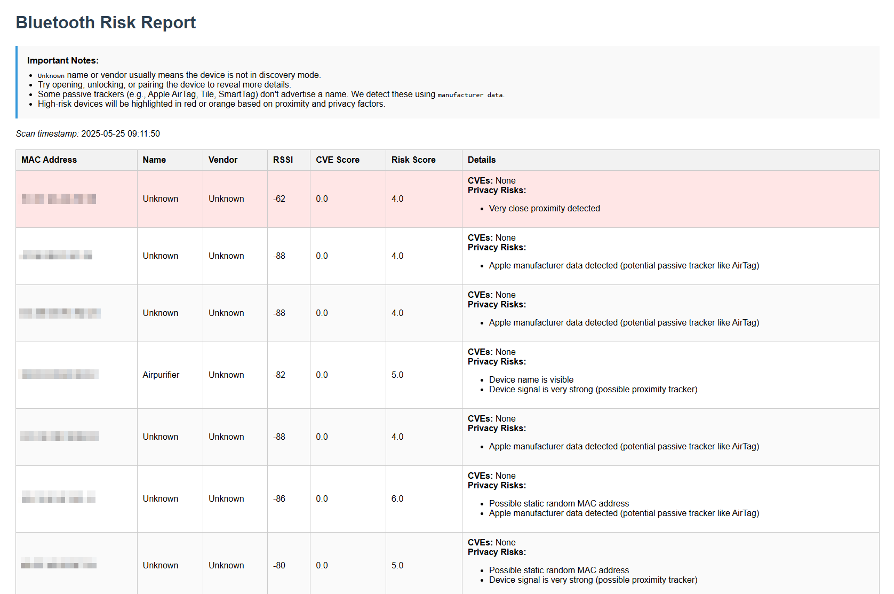

# Bluetooth Risk Scanner 🔍

Bluetooth Risk Scanner passively detects nearby BLE (Bluetooth Low Energy) devices and evaluates them for privacy and security risks — including silent trackers like AirTags, vulnerable wearables, and devices with exposed GATT services.

Unlike simple scanners, this tool classifies threats based on proximity, vendor reputation, advertising behavior, and CVE history.

> ⚠️ **This project is actively maintained and evolving.**  
> Features like custom risk scoring, BLE behavior anomaly detection, and advanced reporting are under development.

## 💞 Motivation

This project was inspired by increasing reports of Apple AirTags and other BLE trackers being used in stalking and other crimes. I developed Bluetooth Risk Scanner to help individuals and security teams identify potential privacy risks from nearby Bluetooth devices — especially those that may be tracking users without their knowledge.

The goal is to raise awareness of Bluetooth-based threats and provide a lightweight, actionable tool for BLE risk assessment.

## 🚀 Features

- Passive BLE scan using `bleak`
- Detect name, RSSI, MAC (when available), manufacturer ID, service UUIDs
- Vendor detection using IEEE OUI (`manuf`-like logic)
- Privacy risk scoring:
  - Static MAC behavior
  - Proximity tracking (RSSI-based)
  - Manufacturer-based passive tracker detection (e.g. Apple AirTag)
  - GATT service analysis (e.g. heart rate, user data)
- HTML + JSON reports with color-coded risk indicators
- Ubertooth branch available for sniffer-mode scanning

## 🎛️ Risk Model

The following factors contribute to a device's total `risk_score`:

| Category         | Indicators Detected                                         | Score |
|------------------|-------------------------------------------------------------|-------|
| **Proximity**     | RSSI > -65 → Very Close                                     | +2    |
| **Identity Leakage** | Name is visible / MAC reveals vendor                      | +1–2  |
| **MAC Behavior**   | Static/random MAC address patterns                         | +2    |
| **Passive Tracker** | Apple (AirTag), Tile, Samsung SmartTag via Manufacturer ID | +2    |
| **BLE Services**    | Sensitive UUIDs like Heart Rate, User Data                | +3    |


## 📋 Usage

```bash
git clone https://github.com/schoi1337/bluetooth-risk-scanner.git
cd bluetooth-risk-scanner

# Activate virtualenv
source .venv/bin/activate  # or .venv\Scripts\activate on Windows

# Install dependencies
pip install -r requirements.txt

# Run the scanner (default: 10s scan, no RSSI filter)
python main.py

# Custom scan: 15s timeout, ignore weak signals
python main.py --timeout 15 --min-rssi -85
```

### 🔣 Options
- `--timeout`: Scanning timeout in seconds (default: 10)
- `--min-rssi`: Minimum RSSI threshold to filter out weak signals (default: -100)

Reports are saved to:
- `output/scan_report.json`
- `output/scan_report.html` 

### 📸 Sample Output




## 🧪 Platform Notes

| OS        | BLE MAC Available? | Notes                                                  |
|-----------|---------------------|---------------------------------------------------------|
| Linux     | ✅ Yes              | Full support via BlueZ (recommended)                   |
| Windows   | ✅ Yes              | Most BLE dongles supported                             |
| macOS     | ❌ No               | CoreBluetooth hides MACs → UUIDs only (limited vendor detection) |

## 🛰️ Ubertooth Branch

Use Ubertooth to sniff BLE advertisements without needing an HCI-compatible dongle:

📦 [`feature/ubertooth-support`](https://github.com/schoi1337/bluetooth-risk-scanner/tree/feature/ubertooth-support)

## 🧭 Roadmap

- [x] HTML + JSON reporting implemented
- [x] Improve MAC address to vendor matching accuracy
- [x] Scoring model with privacy risk detection
- [ ] Integrate CVE database lookup (NVD API integration)
- [ ] Add more privacy risk indicators based on BLE advertisement data
- [ ] Introduce scoring weight configuration via YAML for custom risk models
- [ ] Detect behavioral anomalies (e.g. MAC/name switching) to flag evasive BLE devices
- [ ] Visualize risk severity (Low/Medium/High/Critical) in HTML report with filters
- [ ] Build optional CLI interface for batch scan + scheduled reports

## 🤝 Contributing

PRs welcome. Submit bugs, ideas, or integrations via issues.

## 📄 License

This project is licensed under the MIT License.
